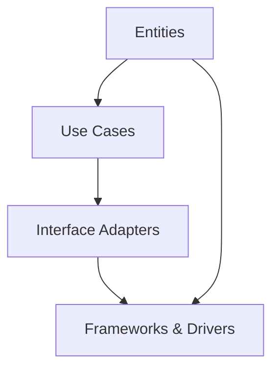
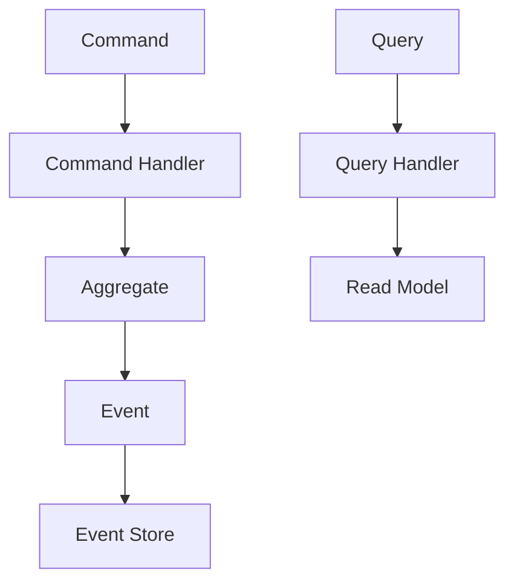
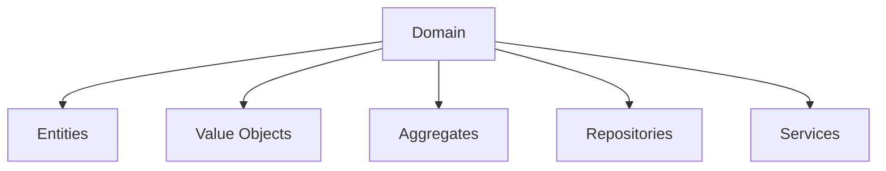

# Examples Clean Architecture


## Project Overview
This repository contains various examples of Clean Architecture implementations, showcasing the principles of Clean Architecture, CQRS (Command Query Responsibility Segregation), and DDD (Domain Driven Design). These examples aim to demonstrate how to build maintainable, testable, and scalable applications.

## Setup Instructions
1. Clone the repository:
   ```bash
   git clone https://github.com/gonzaromeroatton/examples-clean-arquitecture.git
   cd examples-clean-arquitecture
   ```
2. Install dependencies:
   ```bash
   npm install
   ```

## Run/Test Steps
To run the application, use:
```bash
npm start
```
To run the tests, use:
```bash
npm test
```

## Folder Structure
```
/examples
  ├── service-a
  │   ├── src
  │   └── tests
  ├── service-b
  │   ├── src
  │   └── tests
  └── shared
      ├── domain
      ├── infrastructure
      └── application
```

## Architecture Explanation
### Clean Architecture
Clean Architecture is a way of structuring applications to make them independent of frameworks, UI, and databases. The aim is to create a separation of concerns, allowing for greater flexibility and easier testing.



### CQRS
CQRS separates the read and write sides of an application, allowing for different models to handle each side. This separation can help optimize performance, scalability, and security.



### DDD
Domain Driven Design focuses on creating a shared understanding of the problem domain between teams and encapsulating logic into domain models. This fosters better communication and a more organized codebase.



## Contribution
Contributions are welcome! Please check the [contributing guidelines](CONTRIBUTING.md) for details.

## License
This project is licensed under the MIT License - see the [LICENSE](LICENSE) file for details.