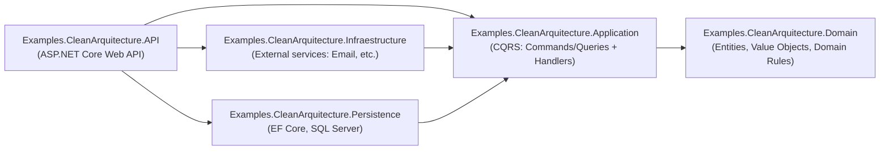
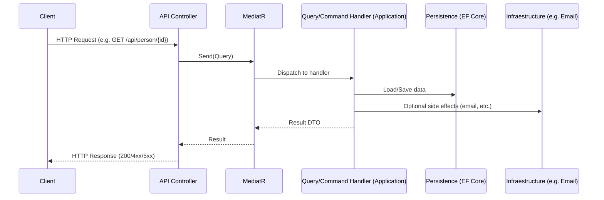
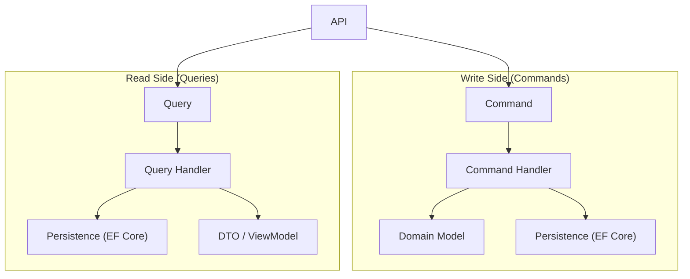

# Examples.CleanArquitecture — Clean REST API (CQRS + DDD)


Clean API REST architecture example using **Clean Architecture**, **CQRS** and **DDD**.  
The **main entry point** is the **API** project (`Examples.CleanArquitecture.API`).

---

## Table of contents

- [Repository description](#repository-description)
- [Architecture at a glance](#architecture-at-a-glance)
- [Solution structure](#solution-structure)
- [Tech stack](#tech-stack)
- [Getting started](#getting-started)
  - [Prerequisites](#prerequisites)
  - [Run the API](#run-the-api)
  - [OpenAPI / Swagger](#openapi--swagger)
- [Configuration](#configuration)
  - [Database](#database)
  - [Email](#email)
- [API endpoints (example)](#api-endpoints-example)
- [CQRS flow](#cqrs-flow)
- [Diagrams](#diagrams)
- [License](#license)

---

## Repository description

> **Clean API REST arquitecture example, CQRS and DDD.**

This repo demonstrates a common setup for backend systems where:
- The **Domain** contains the core business model
- The **Application** layer contains **use cases** (CQRS handlers)
- The **Infrastructure / Persistence** layers integrate external concerns (email, database, etc.)
- The **API** exposes HTTP endpoints and delegates work through **MediatR**

---

## Architecture at a glance

**Rule of thumb:** dependencies flow inwards.

- **API** → references Application, Infraestructure, Persistence  
- **Infraestructure** → references Application  
- **Persistence** → references Application  
- **Application** → references Domain  
- **Domain** → references nothing (ideally)

---

## Solution structure

Solution file:

- `Examples.CleanArquitecture.sln`

Projects (under `Examples.CleanArquitecture/`):

- `Examples.CleanArquitecture.API` (main project)
- `Examples.CleanArquitecture.Application`
- `Examples.CleanArquitecture.Domain`
- `Examples.CleanArquitecture.Infraestructure`
- `Examples.CleanArquitecture.Persistence`

---

## Tech stack

- **.NET 9** (`net9.0`)
- **ASP.NET Core Web API**
- **MediatR** (CQRS dispatch)
- **AutoMapper**
- **FluentValidation**
- **Entity Framework Core** + **SQL Server provider**
- **Swagger / OpenAPI** (Swashbuckle)
- **SendGrid** (email provider)

---

## Getting started

### Prerequisites

- Install **.NET SDK 9**
- If you want to use the default connection string, you can use **SQL Server LocalDB** (Windows).  
  Otherwise, update the connection string to point to your SQL Server instance.

### Run the API

From the repository root:

```bash
dotnet restore
dotnet build
dotnet run --project Examples.CleanArquitecture/Examples.CleanArquitecture.API/Examples.CleanArquitecture.API.csproj
```

The API is configured with:
- Controllers
- CORS policy named `all` (AllowAnyOrigin/Method/Header)
- HTTPS redirection
- Swagger enabled in Development
- Custom exception middleware

### OpenAPI / Swagger

When running in `Development`, Swagger UI is enabled. Open:

- `https://localhost:<port>/swagger`

---

## Configuration

### Database

`Examples.CleanArquitecture.API/appsettings.json` contains:

- Connection string key: `ConnectionStrings:PersonsConnectionString`
- Default value:
  - `Server=(localdb)\mssqllocaldb;Database=db_persons;Trusted_Connection=True;MultipleActiveResultSets=true`

If you are not using LocalDB, change it to your SQL Server connection string.

### Email

`Examples.CleanArquitecture.API/appsettings.json` contains:

```json
"EmailSettings": {
  "ApiKey": "SendGrid-Key",
  "FromAddress": "no-reply@persons.com",
  "FromName": "Persons Management System"
}
```

Set your real SendGrid API key and sender information as needed.

---

## API endpoints (example)

The sample domain shown in the API layer is **Person**.

Controller:
- `api/person`

Available example endpoints:

- `GET /api/person/{id}`
- `GET /api/person/dni/{dni}`

These endpoints call the Application layer through **MediatR** queries:
- `GetPersonByIdQuery`
- `GetPersonByDniQuery`

---

## CQRS flow

This project uses CQRS via MediatR:

- **API Controller** receives HTTP request
- Sends a **Command** or **Query** via `IMediator`
- **Handler** executes the use case in the Application layer
- Handler interacts with:
  - Domain model (business rules)
  - Persistence (EF Core / DbContext, repositories, etc.)
  - Infraestructure services (e.g., email via SendGrid)

---

## Diagrams

### Clean Architecture (project dependencies)



### Request flow (HTTP → MediatR → Use Case)



### CQRS (Commands vs Queries)



---

## License

This project is licensed under the **MIT License**. See [LICENSE](LICENSE).
